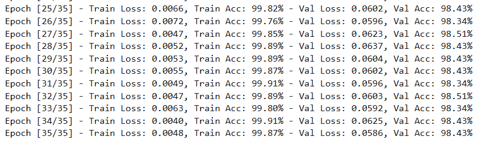
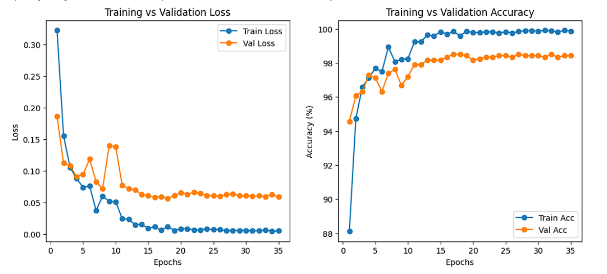
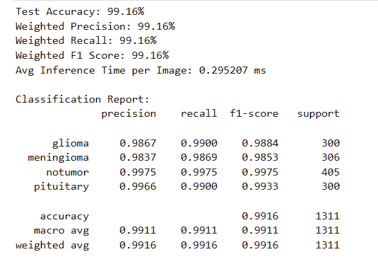
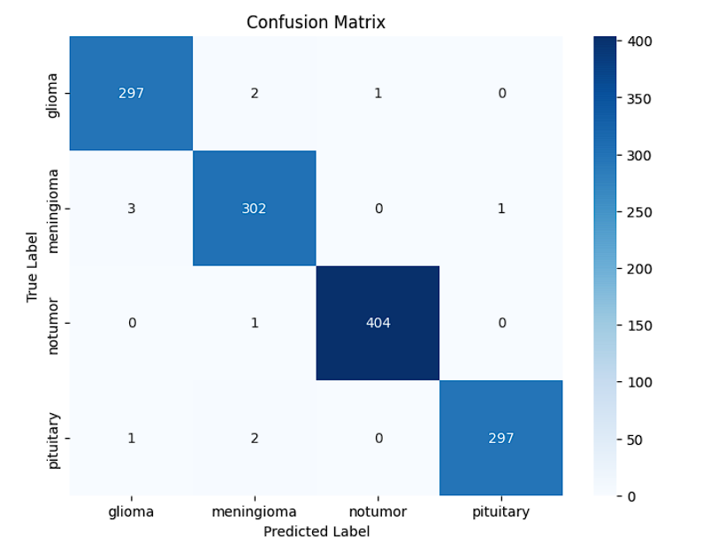

experiment : 6
    Drop out = 0.3   Adam optimizer
    num_epochs=35, lr=1e-4 , weight_decay=1e-5, scheduler = StepLR(optimizer, step_size=10, gamma=0.1)
    put the original data and process directly before training the model

